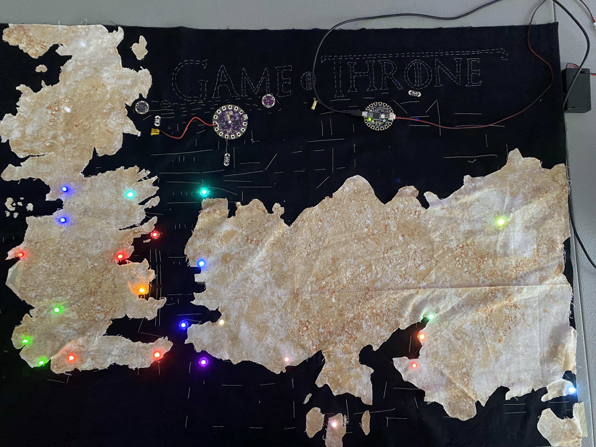
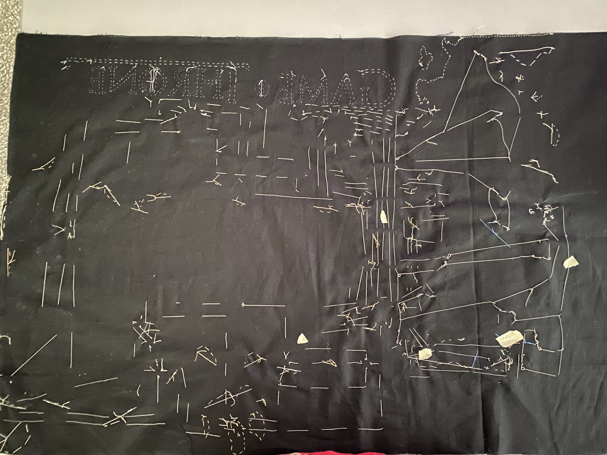

# Game of Thrones Tapestry 
This project consists of 2 separate .ino files for Arduino boards, and, of course, everything else on the 2ft by 3ft tapestry that cannot go in a GitHub repo directly. For pictures of the project, jump down to the bottom of the README, which has the demonstration images, and even a video of the theme song off an Arduino buzzer!

## Background

This project was created for my CSCI 497 midterm, but quickly became a passion project as I spent an obscene amount of time creating a completely functional and (relatively) to-scale map of the Game of Thrones universe. The map I used was the concept map for the show adaptation's later seasons, which, in the end, isn't the 'canon' map, or even makes sense in-universe, but who cares! Definitely not me... ~~I will never forgive you, David Benioff and D.B. Weiss~~ 😅

## Concepts

This project combines 3 core skills: Sewing, Electrical circuitry, and 2 Arduino's for some C++ programming.
I am no good at sewing, and electrical circuitry is more of a personal passion than my profession, but in the end, a working tapestry was made! By combining actuators and sensors along the various pins available on both my first Arduino board (Lilypad Protosnap Plus) and my second Arduino board (FLORA), leading to one of the most time-consuming projects I have completed.

## Implementation

### Motherboard (Background)
The map itself is created on a black fabric 2x3' tapestry, which acts as the 'motherboard' of the project. This is because every piece of electronics on the tapestry is connected using conductive thread, and if ANY of them touch, it will short the Arduino and turn off for safety reasons. This means the electrical thread is (for the most part) extremely organized, well-spaced, and definitely did not make me almost quit the project.

### Land Mass (Foreground)
The landmass of the project is created from a papyrus fabric cut into the shape of the 2 continents and the various islands, of which most are not even mentioned. Because of this, I only really added the islands that appear in the show, like the Iron Islands, Dragonstone, etc.

### Cities & Keeps (Lights - Actuator)
The castles of Game of Thrones are divided in their structure between Westeros and Essos (the West and East continents). Westeros has a feudal system much like medieval Europe, where families and clans would make alliances, declare war, and most importantly, bend the knee. To demonstrate this in this project, the LEDs used for the different cities' house colors matched their color in the universe! Red for Lannister, Orange for Dorne, etc. Normal LEDs, like ones on a Christmas tree, are used for these general colors, and more complex colors like teal for The Vale are done with the limited Neopixels I had for the midterm.  

Essos, on the other hand, is filled with self-governing cities. Since there is no house color to base the cities off, I decided to use Neopixels for every city in Essos. With them all being Neopixels, I was able to program their color to match the culture, traditions, and beliefs associated with each city in Essos. For instance, (<ins>**SPOILER**</ins>) Braavos, a city where the many-faced god resides, is a tealish color, since their practices consist of water, illusions, and espionage.

### Wiring
Wiring the Arduinos, sensors, and actuators is completely done with conductive thread. Unlike a normal piece of thread, conductive thread has a woven structure like rope. This makes it strong, but also allows a super tiny piece of conductive thread to get unraveled or torn in only a few pieces of conductive 'twine.' This would not be an issue if it were not for these pieces of near-invisible metal to bridge the gap to a neighboring piece of conductive thread, or even worse, come off the parent thread completely and bridge a random arc anywhere on the tapestry! This is why a clean work space, pre-planning the conductive thread routes, and careful sewing are all crucial when wiring a project like this.   

The most important wiring is what should be done first - all of the sensors, followed by each house separately on its own port. This is crucial for the next various sensors, controlling them, since they would not otherwise be individually controllable, and it just makes the most sense for each house to have its own connection port.

### Sensors
The sensors controlling the lights for each Arduino consist of at least an on/off switch for the lights. On the Westeros Arduino, there is also a button for the song to play, which requires the lights to be on, and a light sensor to detect how dark the room is. The Essos Arduino has a gravity switch, which, when upright, will send an on signal (1) and an off signal (0) when hanging upside down.

### Light Behavior
The buzzer is programmed to play the Game of Thrones song by having 2 arrays - 1 for the note pitch and the other for its duration. Combining these arrays allows the song to be played, but why stop there? Using the pitch of the note along with the different ports, which are each connected to a different house in Westeros, means we can dynamically change the tapestry while the song is playing! This is done through a function that can quickly determine what lights should be on and off based on the song's pitch. This creates a wave or movement effect, where as the song gets higher pitch, more of Westeros lights up.  
  
Unlike Westeros' Arduino, Essos does not have a buzzer or button connected to it. Because of this limitation, I instead opted to have the gravity sensor control Denary's journey through Essos. She starts in Pentos, moves to the Dathraki camp, and then the rest would be spoilers! If you haven't seen it and have gotten this far in the documentation, please, I beg you, at least watch the first episode. If you don't think you can muster eight seasons, don't worry! ~~Only to season 5, maybe 6 is good.~~

### Power
Each Arduino is connected to a battery of some kind. The Westeros Arduino has a 3.3V rechargeable battery, which recharges when the Arduino is connected to a computer, while the Essos Arduino consists of a 5V battery pack containing 3 AAA batteries.

## Demonstration
  
### Video

### Images & Explanation 
Below is the front and back of the tapestry with the lights on normally.   
    
   
   
Yes, it says 'Game O Throne'! I ran out of silver thread the night before it was due, and at this point, it's more canon than season 8.  
   
As you can see, the back had a decent start in Westeros but quickly devolved after scope creep convinced me to add the Iron Islands and the Riverlands. The wiring fails to impress after this decision, and is more impressive for the fact that it doesn't short anywhere!  
  
  

  
Jokes aside, Essos' wiring is a lot cleaner and uniform in the conductive thread department, due to all being the same type of light, and needing all these lights to run in parallel meant a lot of project planning took place. Westeros ended up needing a lot more patch jobs since it was also done first, and about 2 months before Essos, which was only a few days before this picture was taken. If I could fix one thing, it would be that, but if it works, it works!   
  
I landed on this 4 to 8 split for the Neopixels in Essos, since power consumption through the USB port is around 3V, while the Neopixels are supposed to have around 4.4V. This means that around 4 of them generally work off just the USB. The other 8 Neopixels can be completely powered by the 5V battery, and all 12 can be powered by the battery if the brightness is turned down.  
  
This allows the tapestry to hang proudly on any wall for the small cost of 80 hours and around $100 of electronics (if you're lucky), $30 for fabric, and $20 for conductive thread, along with sewing needles and normal thread. But hey, it's a great conversation piece for life!
  
